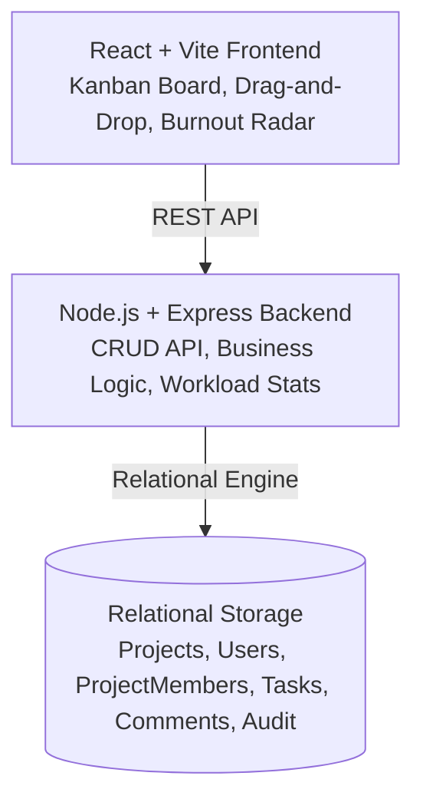

# ⚡ Quantiphi TaskFlow — Streamlined Kanban & Workload Balancing App

[](https://reactjs.org/)
[](https://vitejs.dev/)
[](https://expressjs.com/)
[](https://tailwindcss.com/)
[](LICENSE)

A modern, high-performance, full-stack **Kanban Task Management Application** with **Workload Balancing**, **AI Subtask Generation**, **Smart Auto-Rebalancing**, and **Burnout Warning Radars** built for personal and enterprise team productivity.

---

## 🎯 The Mission & Problem Statement

Created for the **Quantiphi Vibe Coding Round**, fulfilling and exceeding all requirements:

1. **Kanban Board**: Three columns (`To-Do`, `In Progress`, `Done`) with fluid drag-and-drop capability.
2. **Task Cards**: Priority badges (`Urgent`, `High`, `Medium`, `Low`), due dates (with overdue warnings), descriptions, and assignee avatars.
3. **User Controls**: Create tasks, add users to projects with roles (`Admin`, `Member`, `Viewer`), and filter by priority, assignee, and live keyword search.
4. **Backend Logic & Relational Data**: Custom REST CRUD API managing task hierarchies (`projects -> tasks`) and permissions, ensuring all business logic is server-side.
5. **The Vibe Check (Workload Balancing)**: 
   - Column counter badges on all 3 columns.
   - **Burnout Radar**: If any user has **more than 5 tasks in "In Progress"**, their avatar dynamically **pulses red** with a flame badge (`🔥`) to warn of potential burnout.
   - **Smart Auto-Rebalancer**: Single-click algorithm to redistribute excess tasks from overloaded users to available teammates.

---

## ✨ Key Features & Enterprise Upgrades

### 1. 📋 Kanban Board & Workload Radar
* **3-Column Architecture**: `To-Do`, `In Progress`, and `Done` with real-time counter badges.
* **HTML5 Drag-and-Drop**: Visual drop zone cues, optimistic local updates, and celebratory confetti on task completion.
* **Workload Balancing Radar**: Tracks active In-Progress task counts against team capacity.
* **Red Pulsing Burnout Warning**: Dynamic CSS keyframe halo and warning badge triggered whenever `in_progress_count > 5`.

### 2. 🤖 AI-Powered Smart Auto-Rebalance & Subtask Assistant
* **Smart Auto-Rebalance (`⚡`)**: Automatically redistributes excess tasks from overloaded users to available team members with 1 click.
* **AI Subtask Generator (`✨`)**: Context-aware subtask generator producing acceptance criteria directly inside the task creation modal.
* **Interactive Checklists & Progress Bar**: Interactive subtasks on cards that update mini progress indicators (e.g. `2/4 subtasks (50%)`).

### 3. 📊 Sprint Velocity & Analytics Dashboard (Shortcut: `A`)
* Real-time metrics: Sprint Completion Rate (%), In-Progress task focus, Overdue task warnings, and To-Do backlog.
* Team workload capacity distribution bar charts.
* Priority distribution matrix (`Urgent`, `High`, `Medium`, `Low`).

### 4. 💬 Task Comments & Activity Audit Trail
* Slide-over drawer when clicking any task card.
* Chronological audit history (*"Alex Rivera created task"*, *"Priya Sharma moved to IN_PROGRESS"*).
* Live team comments feed with avatars, timestamps, and instant posting.

### 5. 📥 Export & Report Generator (Shortcut: `E`)
* **Spreadsheet (CSV)**: Export all sprint tasks to CSV for Excel / Google Sheets.
* **Raw Data (JSON)**: Complete structured JSON export with subtasks and timestamps.
* **Printable Sprint Report**: Ready-to-print formatted PDF summary.

### 6. ⌨️ Power-User Keyboard Shortcuts (Shortcut: `?`)
* `N`: Create New Task
* `/`: Focus live search
* `A`: Sprint Analytics Dashboard
* `E`: Export & Report Generator
* `T`: Team & Permissions Modal
* `R`: Smart Auto-Rebalance Trigger
* `Esc`: Close any active modal/drawer
* `?`: View keyboard shortcuts guide

---

## 🏗️ Architecture & Relational Schema



### Relational Schema Design
- **`users`**: `id`, `name`, `email`, `avatar_url`, `role`, `created_at`
- **`projects`**: `id`, `name`, `description`, `color`, `created_at`
- **`project_members`**: `id`, `project_id`, `user_id`, `role` (`Admin`, `Member`, `Viewer`), `joined_at`
- **`tasks`**: `id`, `project_id`, `title`, `description`, `status` (`TODO`, `IN_PROGRESS`, `DONE`), `priority` (`LOW`, `MEDIUM`, `HIGH`, `URGENT`), `due_date`, `assigned_to`, `subtasks`, `tags`, `order_index`, `created_at`, `updated_at`
- **`comments`**: `id`, `task_id`, `user_id`, `user_name`, `user_avatar`, `text`, `timestamp`
- **`activities`**: `id`, `task_id`, `project_id`, `user_name`, `action`, `timestamp`

---

## 📡 REST API Reference

| Method | Endpoint | Description |
|---|---|---|
| `GET` | `/api/health` | Service health & database status |
| `GET` | `/api/projects` | List all projects with task & member counts |
| `POST` | `/api/projects` | Create new workspace project |
| `GET` | `/api/projects/:id/members` | Get project members and roles |
| `POST` | `/api/projects/:id/members` | Add user to project with role |
| `GET` | `/api/projects/:id/workload` | Calculate team workload and burnout flags |
| `POST` | `/api/projects/:id/auto-rebalance` | Smart auto-rebalance excess tasks |
| `GET` | `/api/projects/:id/analytics` | Sprint velocity, completion rate, and priority breakdown |
| `GET` | `/api/projects/:id/export?format=csv` | Export tasks as CSV or JSON |
| `GET` | `/api/tasks?projectId=...` | List and filter tasks (priority, status, assignee, search) |
| `POST` | `/api/tasks` | Create task with subtasks & priority |
| `PUT` | `/api/tasks/:id` | Update full task details |
| `PATCH` | `/api/tasks/:id/status` | Update column status (drag-and-drop) |
| `PATCH` | `/api/tasks/:id/subtasks/:subtaskId/toggle` | Toggle subtask completed state |
| `POST` | `/api/tasks/:id/comments` | Add comment to task |
| `POST` | `/api/tasks/generate-subtasks` | AI subtask generation engine |
| `POST` | `/api/tasks/simulate-burnout` | Helper to simulate overload scenario (>5 tasks) |

---

## 🚀 Quickstart & Setup Guide

### Prerequisites
- **Node.js** (v18+)
- **npm** (v9+)

### Installation

```bash
# 1. Clone the repository
git clone https://github.com/amritsharan/Kanban-Task-Management-App.git
cd Kanban-Task-Management-App

# 2. Install server dependencies
cd server
npm install

# 3. Install client dependencies
cd ../client
npm install
```

### Running Locally

```bash
# Terminal 1 - Start the Backend API Server:
cd server
npm start
# -> API running at http://localhost:5000

# Terminal 2 - Start the Frontend Web App:
cd client
npm run dev
# -> Frontend running at http://localhost:3000
```

---

## 🛠️ Tech Stack

- **Frontend**: React 18, Vite 5, Tailwind CSS, Lucide Icons, Canvas-Confetti
- **Backend**: Node.js, Express, Relational Data Engine with JSON persistence
- **Architecture**: REST API, Relational Foreign Keys & Cascading Deletes, Optimistic State Sync

---

## 📄 License

This project is licensed under the MIT License.
